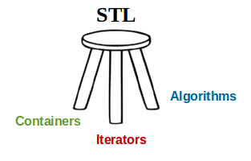

# STL.js



**Standard Template Library for {Type,Java}Script projects**

## Why?

Have you ever been in a situation where you need to use a deque but you don't have such a thing in JavaScript?
"Why don't you use an array?", they might ask. I'd like to give an answer: **time complexity**

Let's take a look at the deque example. It has `O(1)` for `{push,pop}_{front,back}` (C++ API) operations, in a word, it's a doubly linked list and you can push and pop items to boths ends fast. You can't take an arbitrary element by index as you can do with arrays, and that's the price you pay. That's fine since you don't need to, doubly linked lists serve the different purpose.

What's about `pop` vs `unshift` complexity of `Array` in V8?

Let's dive into [source code](https://github.com/v8/v8/blob/8b11e91f217065f11ebe84ca7bef8061a4214bb2/src/elements.cc#L2465). (commit on 10, May)

```cpp
if (remove_position == AT_START) {
  Subclass::MoveElements(isolate, receiver, backing_store, 0, 1, new_length, 0, 0);
}
```

As you can see it moves the elements to relayout memory, as you might expected. It's `O(n)` in worst case.

## Deque

Compliant with **JavaScript Array API**: `push`, `pop`, `shift`, `unshift`.

```ts
import { Deque } from 'stljs/src/deque';

const deque = new Deque<number>()

deque.push(1);
deque.push(2);
deque.push(3);

// returns 1, in O(1) time
deque.shift();
```
